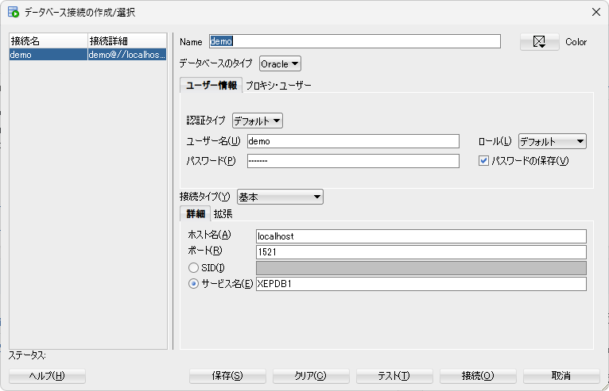

# Spring Boot

#Spring

  

Spring Frameworkを使いやすくするエコシステム（フレームワーク）

  

Spring Frameworkや様々なプロジェクトの組み合わせを`out-of-the-box`⁠で即使用出来るようにサポートされている

- AutoConfigrationでおすすめな設定が自動で行われる
- BomとStarterプロジェクトでライブラリのバージョンと組み合わせを保証
- 強力なプロパティ機構により、柔軟な設定変更が可能（application.propertiesかapplication.yml）
- 組み込みサーバ（同期：Tomcat、非同期：Netty、・・・）を同梱し、スタンドアローンで簡単にアプリを実行可能（実行可能jar）
- Actuatorで運用に必要な機能を提供

  

out-of-the-box（OOTB）：箱から取り出したらすぐ使える＝設定作業をほとんどすることなくすぐ使える

  

Spring Frameworkには「機能の使い分けが困難」といったデメリットがある→Spring Bootが登場

主な機能として、複数のフレームワークを使用する際に発生する、Bean定義やXML設定などを、可能な限り自動設定する機能が搭載されてる

  

  

  

  

[引用元](https://licensecounter.jp/devops-hub/blog/spring-boot1/ "https://licensecounter.jp/devops-hub/blog/spring-boot1/")  

  

## AutoConfigration

  

Bean定義を、Spring Bootが自動で行ってくれる仕組み

→ライブラリが提供するクラスのBean定義、各種機能の有効化を行ってくれる

例えば、AutoConfigrationを使わない場合、DB接続用のパラメータを格納したBeanを定義してDB接続を行う必要があるが、AutoConfigrationを使うとそのBeanを定義せずとも裏で勝手に定義してくれてDB接続用のインスタンスを利用できる

  

デフォルトでは全設定が有効化されている

  

[Spring BootのAutoConfigureの仕組みを理解する](https://qiita.com/kazuki43zoo/items/8645d9765edd11c6f1dd "https://qiita.com/kazuki43zoo/items/8645d9765edd11c6f1dd")  

  

## Bom

  

**Bill of Materials (BOM)** は、特定のプロジェクトやライブラリ群における依存関係のバージョンをまとめて定義したもの

BOMを利用すると、各ライブラリのバージョンを明示的に指定する必要がなく、BOM内に定義されたバージョンが自動的に適用される

Spring Bootでは、`spring-boot-dependencies`というBOMがあり、Springの様々なモジュール（例：Spring MVC、Spring Data、Spring Securityなど）や、その他の一般的なライブラリ（Jackson、Hibernateなど）の推奨バージョンを提供される

  

Gradleでは、`platform()`を使って`spring-boot-dependencies`をインポートすることで、Mavenと同じように依存関係のバージョンが自動的に設定される

  

メリット

- 依存関係のバージョン管理が簡単：BOMを使うことで、複数のライブラリやモジュールのバージョンを一元管理できます。
- 互換性の保証：Spring Bootが提供するBOMを利用することで、依存関係のバージョン間での互換性が保証されます。
- メンテナンス性の向上：各依存関係のバージョンを手動で管理する必要がなく、BOMのバージョンを更新するだけで、プロジェクト内の依存関係が自動的に最新バージョンに更新されます

  

## Starter

  

アプリケーションを作るときにあったら必要であろう依存関係を含んだ便利パック

  

[Starterプロジェクト](https://start.spring.io "https://start.spring.io")  

  

## プロパティ

  

設定情報を記載するファイル

デフォルトでは`.properties` 形式、`.yml` 形式も使用できこちらのほうが見やすい

  

[アプリケーションプロパティファイル](https://zenn.dev/willyang/articles/b334068a6db38e "https://zenn.dev/willyang/articles/b334068a6db38e")  

  

## 組み込みサーバ

  

Webフレームワークを使用する場合、Webサーバが同梱される

本機能により、わざわざwarファイルをWebサーバで起動する必要がなく、実行可能jarを実行するだけで良い

  

- Tomcat：SpringMVCの場合
- Netty：SpringWebFluxの場合

  

## Actuator

  

Spring Bootで開発したアプリケーションの監視や管理といった機能を提供する、「運用向け」のSpringライブラリ

actuatorを有効化するとエンドポイントが追加され、そのエンドポイントにアクセスすることで機能を利用できる

  

追加されるエンドポイント（他にもあり）

- health：アプリが正常に起動しているか確認できる
- beans：DIコンテナ上で管理しているBean情報を確認できる
- env：実行するマシンや仮想環境に設定されている環境変数を確認できる
- loggers：アプリのログを確認できる
- metrics：メトリクス情報を確認できる（JVMのCPUやメモリの使用率、ディスクの使用量など）

  

[Spring Boot Actuatorとは？](https://camp.trainocate.co.jp/magazine/about-spring-boot-actuator/ "https://camp.trainocate.co.jp/magazine/about-spring-boot-actuator/")